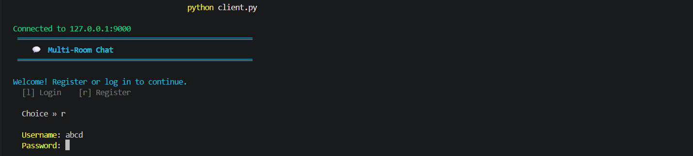
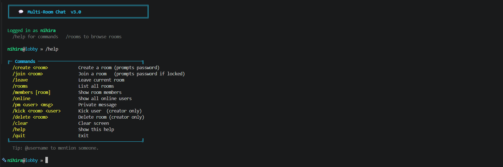

# 💬 **Multi-Room Chat System**

A real-time multi-user chat application built using Python socket programming and multithreading, supporting multiple chat rooms and real-time communication.

---

## Features
- User Authentication (Register/Login with persistence)
- Multi-Room Chat System
- Password-Protected Rooms
- Private Messaging (DMs)
- Real-Time Communication
- Admin Controls (Kick users, Delete rooms)
- Persistent Storage (users & rooms)
- Live Server Activity in Terminal

---

##  Architecture

* Client-Server Model
* TCP Socket Programming
* JSON-based Communication 
* Multithreaded Server (handles multiple clients simultaneously)

---

##  Project Structure

```
 Multi-Room-Chat-System
 ├── server.py
 ├── client.py
 ├── users.json
 ├── rooms.json
 ├── screenshots/
 └── README.md
```

---

##  How to Run

### 1. Start the Server

```
python server.py
```

### 2. Run the Client

Same Laptop
```
python client.py
```
Different Laptop (Same WiFi / LAN)
```
python client.py --host <SERVER_IP>
```
Example:

```bash
python client.py --host 192.168.1.10
```

---

##  Screenshots

Login


Commands


Chat Room


---

##  Technologies Used

* Python
* Socket Programming
* Multithreading
* JSON

---

##  Limitations

* Works only within LAN
* No encryption implemented
* CLI-based (no GUI)
* No permanent chat history

---

##  Future Enhancements

* GUI (Tkinter / Web)
* Chat history storage
* Secure communication (encryption)
* Cloud deployment
* Mobile App Integration

---

